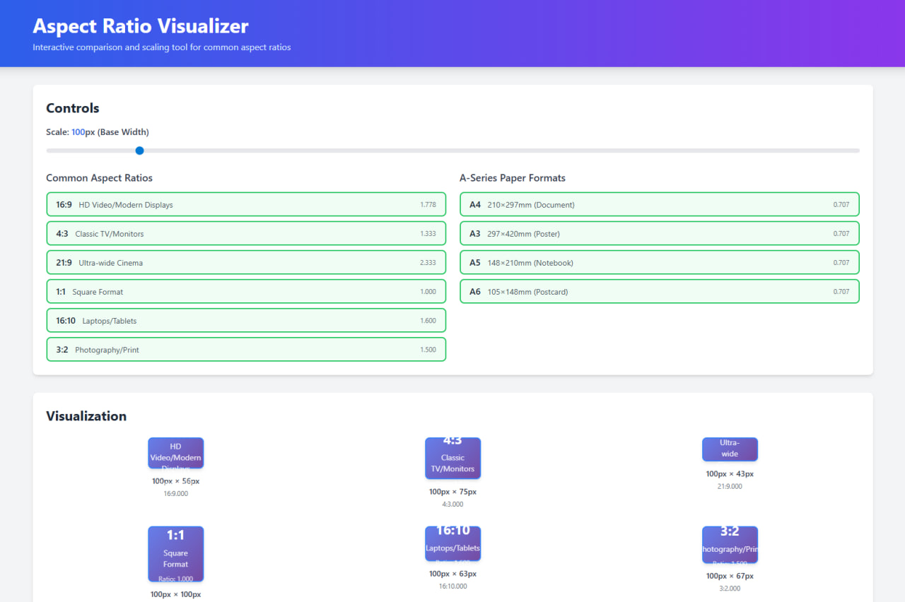

# Aspect Ratio Visualizer

Interactive aspect ratio comparison and scaling tool built with JavaScript and Tailwind CSS.



## Features

- **Common Aspect Ratios**: Visualize popular aspect ratios including:
  - 16:9 (HD Video/Modern Displays)
  - 4:3 (Classic TV/Monitors)
  - 21:9 (Ultra-wide Cinema)
  - 1:1 (Square Format)
  - 16:10 (Laptops/Tablets)
  - 3:2 (Photography/Print)

- **A-Series Paper Formats**: Support for international paper sizes:
  - A4 (210×297mm - Documents)
  - A3 (297×420mm - Posters)
  - A5 (148×210mm - Notebooks)
  - A6 (105×148mm - Postcards)

- **Real-time Resizing**: Interactive slider to scale visualizations from 50px to 500px base width
- **Scalable Previews**: All aspect ratio boxes maintain their proportions while scaling
- **Interactive Selection**: Click to toggle aspect ratios on/off
- **Responsive Design**: Works on desktop, tablet, and mobile devices
- **Visual Feedback**: Smooth transitions and hover effects

## Usage

Simply open `index.html` in your web browser to start using the tool.

### Local Usage

1. Clone the repository:
   ```bash
   git clone https://github.com/BaseMax/aspect-ratio-visualizer.git
   cd aspect-ratio-visualizer
   ```

2. Open `index.html` in your browser:
   ```bash
   # On macOS
   open index.html
   
   # On Linux
   xdg-open index.html
   
   # On Windows
   start index.html
   ```

### How to Use

1. **Select Aspect Ratios**: Click on the aspect ratio buttons to toggle them on/off
2. **Adjust Scale**: Use the slider to change the base width of visualizations (50-500px)
3. **Compare**: View multiple aspect ratios side-by-side to compare their proportions
4. **Real-time Updates**: All changes are reflected immediately in the visualization

## Technical Details

- **No Build Required**: Uses Tailwind CSS via CDN
- **Pure JavaScript**: No frameworks or dependencies
- **Modern CSS**: Utilizes CSS Grid, Flexbox, and transitions
- **Responsive**: Mobile-first design with Tailwind breakpoints

## Technologies Used

- HTML5
- CSS3 (via Tailwind CSS)
- Vanilla JavaScript
- Tailwind CSS (CDN)

## Browser Support

Works on all modern browsers that support ES6 JavaScript and CSS Grid:
- Chrome/Edge 60+
- Firefox 60+
- Safari 12+
- Opera 47+

## License

MIT License - see LICENSE file for details

## Contributing

Contributions are welcome! Feel free to open issues or submit pull requests.

## Author

BaseMax
